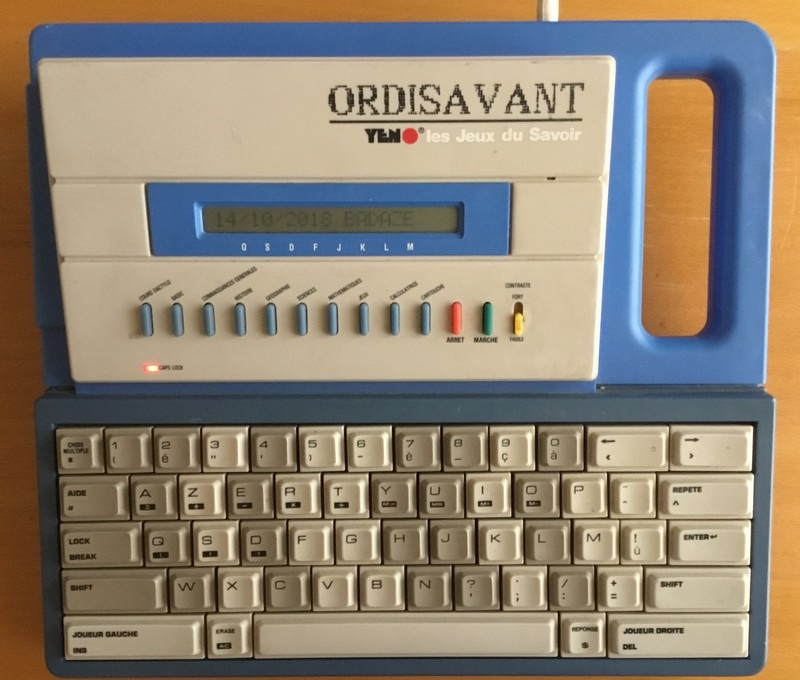

# Yeno OrdiSavant - Xtase-fgalliat

**Xtase-fgalliat project reborn on Nov. 2020**

- re-use of this case for Rpi /or/ Arduino-like MCU computing
- **hardware :**
  - original 8x8 matrix keyboard (AZERTY model)
  - 4" TFT display (ILI9486 SPI driven)
  - LCD 20x4 (I2C driven) ?
  - Ext port slot on left side
  - USB 5v Battery
  - Rpi /or/ MCU (maybe an ESP32)
  - SD Card support
  - DFPlayer for MP3 playback ?
  - another MCP23017 for additional GPIO ?
- **software :**
  - XtsLuaMCU
  - Text Editor
  - partial VT100 console emulation
  - WiFi support (telnet Server, Http Server)
  - BT SPP
  - TvOut / External Display (composite Tv, VGA, HDMI)